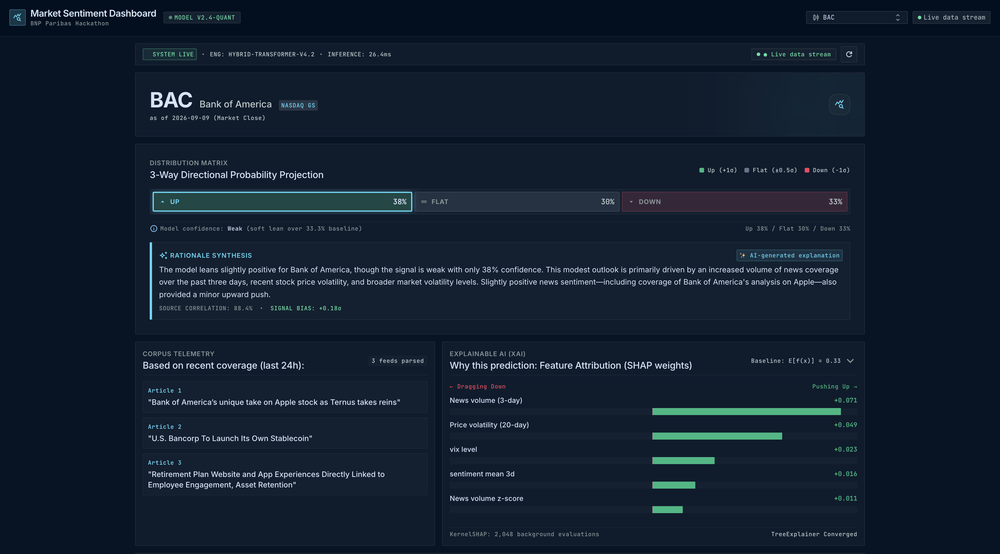

# Market Sentiment Dashboard

Next-day directional prediction for 15 large-cap equities, powered by XGBoost + FinBERT sentiment + SHAP explanations, with a plain-English summary generated by Gemini.

---



> Live prediction for BAC -- a weak upward lean (38% / 30% / 33%), the headlines
> it was read from, and the exact TreeSHAP contribution behind every driver.

## What you're looking at

Pick a ticker and the dashboard answers one question -- *where does this stock go
tomorrow, and why?*

- **Distribution matrix** -- a 3-way probability split (up / flat / down) against a
  33.3% baseline, so a weak signal reads as weak instead of hiding behind a single
  headline number.
- **Rationale synthesis** -- a plain-English summary from Gemini, written *only*
  from the SHAP attributions and the fetched headlines. It has no freedom to
  invent a story the model didn't tell.
- **Corpus telemetry** -- the actual articles scored by FinBERT for that ticker in
  the last 24h, so every claim in the summary is traceable to a source.
- **Explainable AI (XAI)** -- per-feature TreeSHAP attributions for *this*
  prediction, signed and sorted: what dragged the forecast down, what pushed it up.

---

## 🚀 Deployment (Railway + Vercel)

Everything is pre-configured. Two services, ~15 minutes total.

### Prerequisites

- GitHub account (free)
- [Railway](https://railway.app) account — sign up with GitHub, free Starter tier is enough
- [Vercel](https://vercel.com) account — sign up with GitHub, free Hobby tier is enough
- Your `FINNHUB_API_KEY` and `GEMINI_API_KEY` ready

---

### Step 1 — Push to GitHub

```bash
# From the market-sentiment/ project root:
git remote add origin https://github.com/YOUR_USERNAME/market-sentiment.git
git push -u origin main
```

> Replace `YOUR_USERNAME` with your actual GitHub username. Create the repo
> on github.com first (click **New**, name it `market-sentiment`, leave it
> empty — no README, no .gitignore). Then run the two commands above.

---

### Step 2 — Deploy the backend to Railway

**2a. Create a new project**

1. Go to [railway.app/new](https://railway.app/new)
2. Click **Deploy from GitHub repo**
3. Authorise Railway to access your repos if asked
4. Select **market-sentiment**
5. Railway detects the `Dockerfile` automatically — click **Deploy**

**2b. Add your secret environment variables**

While the first build is running (it takes 5–8 minutes — torch is large):

1. Click your service → **Variables** tab
2. Add these two variables:

   | Name | Value |
   |------|-------|
   | `FINNHUB_API_KEY` | your key from finnhub.io |
   | `GEMINI_API_KEY` | your key from aistudio.google.com |

3. Railway automatically redeploys when you save variables — the second deploy will be from cache and much faster.

**2c. Get your backend URL**

1. Click **Settings** → **Networking** → **Public Networking** → **Generate Domain**
2. Railway gives you a URL like `https://market-sentiment-production.up.railway.app`
3. Copy it — you need it in Step 3

> **Use the port Railway asks for, not 8000.** Railway injects its own `$PORT`
> (usually 8080) and the container binds to that. If you point the domain at
> 8000 you get `502 Application failed to respond` — routing works, but nothing
> is listening. Check the deploy log for the `Uvicorn running on http://0.0.0.0:PORT`
> line and match it.
>
> Also ignore the **Private Networking** entry (`*.railway.internal`). That only
> resolves between services inside Railway — a browser can never reach it.

**2d. Verify the backend is live**

Open in your browser:
```
https://YOUR_RAILWAY_URL/health
```
You should see:
```json
{"status":"ok","model_loaded":true,"n_features":26,"tickers_available":15}
```

> **If the health check fails:** check the **Deploy Logs** tab in Railway.
> The most common issue is a missing API key — the build succeeds but the
> server errors on first request.
>
> **`/health` passing does not mean `/predict` works.** The XGBoost model and
> SHAP explainer load at startup, but FinBERT is only touched on the first real
> prediction. Always test `/predict/AAPL` too — and expect it to be slow the
> first time, since it downloads FinBERT (~400MB) from HuggingFace.

---

### Step 3 — Deploy the frontend to Vercel

**3a. Import the project**

1. Go to [vercel.com/new](https://vercel.com/new)
2. Click **Import Git Repository** → select **market-sentiment**
3. Vercel scans the repo — it will find multiple directories. Set:
   - **Root Directory:** `frontend-react`
   - Framework preset auto-detects as **Vite** ✓

**3b. Add the environment variable**

Before clicking Deploy, scroll to **Environment Variables** and add:

| Name | Value |
|------|-------|
| `VITE_API_BASE` | `https://YOUR_RAILWAY_URL` (no trailing slash) |

Example: `https://market-sentiment-production.up.railway.app`

**3c. Deploy**

Click **Deploy**. Vercel builds in ~30 seconds and gives you a URL like:
```
https://market-sentiment.vercel.app
```

**3d. Verify end-to-end**

Open the Vercel URL in your browser, select any ticker, and confirm a
prediction loads. That's it — you're live.

---

### Environment variable summary

| Service | Variable | Where to set |
|---------|----------|--------------|
| Railway (backend) | `FINNHUB_API_KEY` | Railway → Variables tab |
| Railway (backend) | `GEMINI_API_KEY` | Railway → Variables tab |
| Vercel (frontend) | `VITE_API_BASE` | Vercel → Project Settings → Environment Variables |

`VITE_API_BASE` must be set **before** the Vercel build runs (not after),
because Vite bakes it into the static bundle at build time.

---

### Redeploying after changes

```bash
# Make your changes, then:
git add -A
git commit -m "your message"
git push
```

Both Railway and Vercel watch the `main` branch and redeploy automatically.

---

### Demo-day checklist (morning of the presentation)

Run these locally before you leave to refresh the fallback snapshots —
they're small parquet files already in the repo, but fresher is better:

```bash
source .venv/bin/activate
python scripts/03_snapshot_live.py    # refreshes news fallback
python scripts/04_snapshot_live_prices.py  # refreshes price fallback
git add data/raw/live/
git commit -m "chore: refresh demo-day live snapshots"
git push
```

Railway picks up the new snapshots and redeploys. If the venue wifi dies
mid-demo, the API falls back to these files automatically and shows a
small "Using cached data" badge in the UI — no crash, no blank screen.

---

### Troubleshooting

**Backend build times out on Railway (> 15 min)**
The first build pulls PyTorch (~800 MB CPU wheel). Railway's free tier has
a 15-minute build limit — if it hits it, retry once. Docker layer caching
means the second attempt skips the torch download entirely and finishes in
under 3 minutes.

**`/predict` returns 500 after deploy**
Check Railway logs. 95% of the time it's `GEMINI_API_KEY` not set or
set with a typo. The other 5% is `FINNHUB_API_KEY`.

**Frontend shows "Cannot reach API" error**
`VITE_API_BASE` is missing or has a trailing slash. Go to Vercel →
Project Settings → Environment Variables, fix it, then trigger a redeploy
(Deployments → ⋯ → Redeploy).

**Cold start takes 30+ seconds on first `/predict` call**
Normal — Railway's Starter tier keeps the process warm but the first
request after a fresh deploy loads torch + SHAP + the model. Subsequent
calls within 5 minutes are fast (cached). Show a loading state in the demo
and warn your audience about the first call.

---

## Quick start (backend)

```bash
# 1. Create and activate a virtual environment (recommended)
python -m venv .venv
source .venv/bin/activate

# 2. Install dependencies
pip install -r requirements.txt

# 3. Copy the env template and fill in your API keys
cp .env.example .env
#   FINNHUB_API_KEY=...   → free tier at finnhub.io/register
#   GEMINI_API_KEY=...    → free tier at aistudio.google.com/apikey

# 4. Start the API server
uvicorn api.main:app --reload --port 8000
```

The API will be live at **http://localhost:8000**.  
Interactive docs: http://localhost:8000/docs

## Quick start (frontend — React)

```bash
cd frontend-react
npm install
npm run dev          # dev server at http://localhost:5173
# or
npm run build        # production build → dist/
```

The frontend talks to `http://localhost:8000` by default. To point it at a deployed backend, edit `API_BASE` in `frontend-react/src/lib/api.js`.

## Quick start (frontend — plain HTML fallback)

```bash
# No build step needed, just open directly
open frontend/index.html
```

---

## Project layout

```
market-sentiment/
├── frontend/
│   └── index.html              ← single-file dashboard (open directly in browser)
│
├── api/                        ← FastAPI service
│   ├── main.py                 ← app factory, CORS, router registration
│   ├── dependencies.py         ← shared FastAPI dependencies
│   ├── schemas.py              ← Pydantic request/response models
│   ├── routers/
│   │   ├── health.py           ← GET /health
│   │   ├── tickers.py          ← GET /tickers
│   │   └── predict.py          ← GET /predict/{ticker}
│   └── services/
│       ├── cache.py            ← in-memory TTL cache (5 min default)
│       └── live_predict.py     ← orchestrates fetch → features → model → explain
│
├── src/                        ← ML pipeline (api/ depends on this)
│   ├── collect/                ← Finnhub price + news fetchers
│   ├── features/               ← feature engineering, labels, sentiment aggregation
│   ├── model/                  ← train, SHAP explain, LLM explainer
│   ├── sentiment/              ← FinBERT scoring (ProsusAI/finbert)
│   └── utils/                  ← IO helpers, market time utils
│
├── models/
│   ├── model.json              ← trained XGBoost model (frozen artifact)
│   ├── feature_order.json      ← exact column order for inference (must match model)
│   └── metrics.json            ← CV results (reference only)
│
├── data/
│   ├── raw/live/               ← cached demo-day snapshots (fallback if APIs are down)
│   ├── raw/news/               ← historical news (news_history.parquet)
│   └── raw/prices/             ← historical OHLCV (prices_daily.parquet)
│
├── scripts/                    ← numbered pipeline scripts (data → train → explain)
├── config.py                   ← single source of truth for all paths, tickers, settings
├── requirements.txt
└── .env.example
```

---

## API reference

All responses are JSON. Base URL: `http://localhost:8000` (or your deployed URL).

### `GET /health`

Server liveness + model status.

```json
{
  "status": "ok",
  "model_loaded": true,
  "n_features": 26,
  "tickers_available": 15
}
```

### `GET /tickers`

List of supported tickers for dropdowns.

```json
{
  "tickers": ["AAPL", "MSFT", "NVDA", "AMZN", "GOOGL", "META", "TSLA",
              "JPM", "GS", "BAC", "MS", "XOM", "JNJ", "WMT", "CAT"]
}
```

### `GET /predict/{ticker}`

Main prediction endpoint. `{ticker}` is case-insensitive.

**Success (200)**
```json
{
  "ticker": "AAPL",
  "as_of_date": "2026-09-09",
  "predicted_label": "up",
  "predicted_proba": 0.34,
  "class_probabilities": { "flat": 0.33, "up": 0.34, "down": 0.33 },
  "top_drivers": [
    { "feature": "news_count_3d", "value": 211.0, "shap": -0.089 },
    { "feature": "vol_20d",       "value": 0.013,  "shap": 0.028  }
  ],
  "explanation": "The model leans slightly toward an upward movement...",
  "headlines_used": [
    "Apple debuts Watch Series 12 and Apple Watch"
  ],
  "warning": null
}
```

`warning` is a string (not null) when the live data fetch failed and the response is using a cached snapshot from `data/raw/live/`.

**Errors**
| Status | Meaning |
|--------|---------|
| `400`  | Ticker not in the supported list |
| `500`  | Unexpected server error — `detail` field has the message |

**Performance note:** the first `/predict` call after a server restart fetches live prices and news, runs FinBERT on every headline, and calls Gemini — this takes **5–10 seconds** cold. Subsequent calls within 5 minutes are served from the in-memory cache and return in under a second.

---

## Supported tickers

15 large-caps across sectors (financials over-weighted — BNP Paribas hackathon):

| Sector | Tickers |
|--------|---------|
| Technology | AAPL, MSFT, NVDA, AMZN, GOOGL, META, TSLA |
| Financials | JPM, GS, BAC, MS |
| Other | XOM, JNJ, WMT, CAT |

---

## Things to know before touching the code

### Frozen model artifacts

`models/model.json` and `models/feature_order.json` are a matched pair produced by `scripts/07_train_model.py`. **Do not regenerate one without the other.** If `feature_order.json` drifts from what the model was trained on, predictions go silently wrong — no error, just garbage output. Treat them like a lock-file: only update both together after a full retrain.

### Caching and rate limits

Live data is cached in-memory for 5 minutes (`api/services/cache.py`, constants `PRICE_TTL_SECONDS` and `NEWS_TTL_SECONDS`). Finnhub's free tier allows 60 API calls/minute. Going below ~1 minute TTL risks hitting that limit under normal usage.

### Demo-day fallback

If live fetch fails entirely (API down, rate-limited, no network), the service automatically falls back to the cached parquet snapshots in `data/raw/live/` and sets the `warning` field in the response. The frontend displays a "Using cached data" badge automatically.

**Refresh the fallback snapshots the morning of the demo:**
```bash
python scripts/03_snapshot_live.py
python scripts/04_snapshot_live_prices.py
```

### CORS

`allow_origins=["*"]` is set in `api/main.py` for hackathon convenience. Tighten this to your actual frontend origin before any real deployment.

---

## Retraining the model

Run the numbered scripts in order. Each one writes an artifact that the next reads.

```bash
python scripts/00_setup.py          # create data directories
python scripts/01_collect_prices.py # fetch OHLCV history from Yahoo Finance
python scripts/02_collect_news.py   # fetch news history from Finnhub
python scripts/05_score_sentiment.py # run FinBERT on all headlines
python scripts/06_build_features.py  # engineer feature matrix
python scripts/07_train_model.py     # train XGBoost, write model.json + feature_order.json
python scripts/08_explain_predictions.py # optional: SHAP analysis on test set
```

`scripts/09_generate_explanation.py` is a standalone script for testing the Gemini explainer.

---

## Environment variables

| Variable | Required | Source |
|----------|----------|--------|
| `FINNHUB_API_KEY` | Yes | [finnhub.io/register](https://finnhub.io/register) (free tier) |
| `GEMINI_API_KEY`  | Yes | [aistudio.google.com/apikey](https://aistudio.google.com/apikey) (free tier) |

Copy `.env.example` to `.env` and fill both in. Never commit `.env`.

---

## Frontend

### React app (recommended) — `frontend-react/`

Built with **Vite + React + Tailwind CSS 3**, pixel-matching the Stitch design system (Terminal Horizon theme).

```
frontend-react/
├── src/
│   ├── lib/
│   │   ├── constants.js   ← TICKERS, FEATURE_LABELS, LOADING_STAGES
│   │   └── api.js         ← fetchPrediction / fetchTickers / fetchHealth
│   ├── components/
│   │   ├── Header.jsx         ← fixed nav with ticker select dropdown
│   │   ├── Footer.jsx
│   │   ├── ProbabilityBar.jsx ← 3-way stacked bar (up/flat/down)
│   │   ├── ShapBars.jsx       ← signed SHAP waterfall chart
│   │   ├── HeadlineCard.jsx   ← single news article card
│   │   ├── WatchlistStrip.jsx ← horizontal scrollable ticker strip
│   │   └── StatusStrip.jsx    ← live/cache status + refresh button
│   ├── screens/
│   │   ├── EmptyState.jsx     ← screen 1: ticker grid + methodology panel
│   │   ├── LoadingState.jsx   ← screen 2: animated skeleton + stage labels
│   │   ├── PredictionView.jsx ← screen 3: full prediction with explanation
│   │   ├── LlmFallback.jsx    ← screen 4: prediction without explanation
│   │   └── ErrorStates.jsx    ← screen 5: ErrorTicker (400) + ErrorServer (5xx)
│   ├── App.jsx            ← state machine wiring all 5 screens to the API
│   └── main.jsx
└── tailwind.config.js     ← full Terminal Horizon token set
```

`frontend/index.html` is a self-contained single-file fallback app — no build tooling needed, open directly in a browser. It handles:

| State | Trigger |
|-------|---------|
| **Empty** | On load, no ticker selected |
| **Loading** | Any `fetchPrediction()` call — animated skeleton + progress stages |
| **Prediction** | Successful API response with `explanation` present |
| **Partial failure** | Successful response but `explanation` is null/empty (Gemini timed out) |
| **Unsupported ticker** | API returns 400 |
| **Server error** | API returns 5xx, network failure, or timeout |

To point it at a deployed backend, change `API_BASE` near the top of the `<script>` block:

```js
const API_BASE = 'https://your-deployed-api.example.com';
```

---

## Hackathon notes

- Model accuracy on the held-out test window: see `models/metrics.json`
- The 3-way classification (up / flat / down) uses a volatility-scaled band label so "flat" is not a fixed ±X% — it adapts to each stock's recent volatility
- The LLM explanation is generated by Gemini and is clearly labelled "AI-generated" in the UI; it is **not** investment advice
- SHAP values are computed via `TreeExplainer` on the XGBoost model, one prediction at a time in the live path
